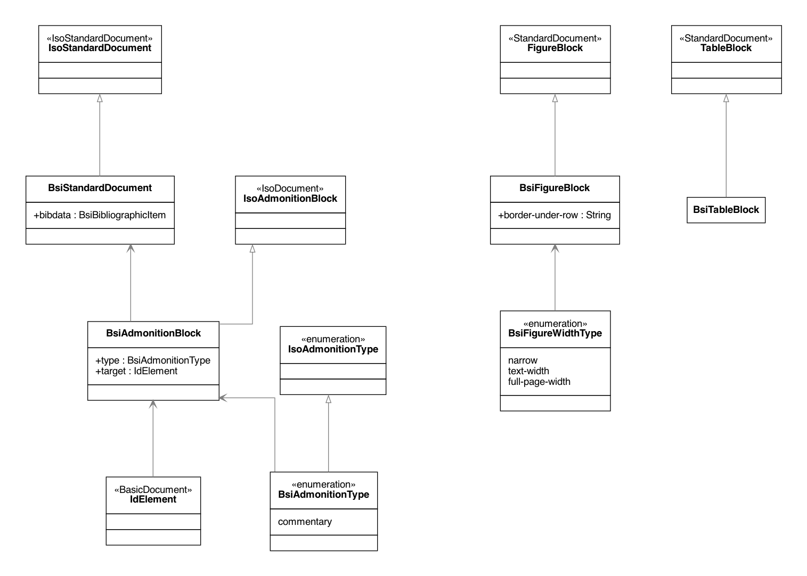

= Metanorma BSI Models

image:https://github.com/metanorma/metanorma-model-bsi/workflows/make/badge.svg["Build Status", link="https://github.com/metanorma/metanorma-model-bsi/actions?query=workflows%3Amake"]

This is where we keep the Metanorma BSI model definitions.

The BSI Standard Document format is an instance of the
https://github.com/riboseinc/metanorma-model-iso[Metanorma ISO model].
Details of the general model can be found on its page.

== BSI Standard Document Model

== BSI Bibliographic Item Model

